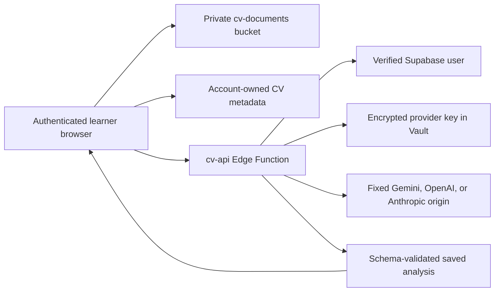

# Account-backed CV Analysis migration

**Status:** Implemented platform slice; database migration and Edge Function must be deployed before use
**Source reviewed:** `saurabhporwal/CA` at `d1aecc127b2a16567b1fe78461f81a50f8b04202`
**Target:** Codeology online platform on the `dev` test environment first

## Product decision

CV Analysis belongs in Codeology when it turns a learner's career material into a concrete improvement and learning loop. The online version is associated with the learner's account and includes the useful Career Architect capabilities:

- authenticated PDF, DOCX, TXT, Markdown, and pasted-text intake;
- private file and analysis history;
- target-role and optional job-description context;
- learner-supplied Gemini credentials stored server-side;
- structured Gemini analysis and CV extraction;
- a target-role CV-readiness score with five inspectable dimensions;
- the CA career-signal set: decision velocity, authority gap, narrative scarcity, authority signal, seniority perception, operational ROI, governance, observability, and scalability;
- strengths, missing signals, an improvement plan, and Codeology lesson links;
- rewrite suggestions and three CV preview templates;
- Print/PDF and real DOCX export; and
- complete file-and-analysis deletion plus provider-key deletion.

The readiness score measures how clearly a CV communicates evidence for the chosen role. It is not a probability of employment and cannot establish identity, authorship, competence, seniority, or suitability for employment. Model output remains formative guidance and never becomes Codeology verified evidence.

## Source and licensing boundary

No explicit licence file was found in the inspected CA snapshot. This implementation therefore ports product capabilities but does not copy source code or visual assets. It also does not import CA's database dump, logs, cookies, credentials, provider-key files, payment code, job crawler, or administrator surfaces. Codeology code is original and follows this repository's platform seams.

## Architecture



The browser uses only the Supabase publishable key and the signed-in user's JWT. It can read and create rows only when `auth.uid()` matches `user_id`. It can upload only into a path beginning with its own user UUID. The service-role key exists only in the Edge Function environment.

Provider keys are posted to `cv-api`, verified against the selected provider and model, encrypted in Supabase Vault, and represented in the public table only by a masked four-character hint. The raw key is never returned, stored in browser storage, placed in a URL, or written to logs. The initial provider allowlist is Google Gemini, OpenAI, and Anthropic; each uses a fixed API origin and a reviewed stable-model allowlist.

## Database and storage contract

Migrations: `supabase/migrations/20260822043422_create_account_backed_cv_analysis.sql` and `supabase/migrations/20260822070000_enable_multiple_ai_providers.sql`

| Surface | Purpose | Direct learner access |
|---|---|---|
| `ai_provider_connections` | Safe provider metadata and masked key hint | Own rows: select; deletion through `cv-api` |
| `private.ai_provider_credentials` | Vault secret reference | None |
| `cv_documents` | File metadata, consent, processing state and role context | Own rows: select/insert/update; deletion through `cv-api` |
| `cv_analyses` | Normalized, versioned provider result | Own rows: select/delete |
| `storage.objects` / `cv-documents` | Original CV files, maximum 10 MB | Own path: select/insert/delete |

Every public table has RLS enabled and explicit grants. Provider-secret RPCs are revoked from `public`, `anon`, and `authenticated` and granted only to `service_role`. Deleting an account cascades through provider metadata, CV metadata, and analyses. The `delete-cv` action removes the private object before its database row so the normal UI cannot orphan a file.

## Edge Function contract

`supabase/functions/cv-api/index.ts` exposes four authenticated actions:

```json
{"action":"save-provider","provider":"gemini","apiKey":"learner key","model":"gemini-3.5-flash"}
{"action":"analyze","documentId":"uuid","connectionId":"uuid"}
{"action":"delete-provider","connectionId":"uuid"}
{"action":"delete-cv","documentId":"uuid"}
```

The function verifies the bearer token itself and rejects unlisted origins. Localhost, the exact `dev` test domain, and the exact Vercel branch-preview aliases are accepted for development; production must set `CODEOLOGY_ALLOWED_ORIGINS` to a comma-separated exact allowlist. Provider and model IDs must match the fixed in-code catalog. Provider hosts are never user-controlled, preventing an SSRF path.

PDF signatures are checked before inline processing. DOCX extraction uses a bounded, dependency-free ZIP reader that accepts only the expected `word/document.xml`, rejects encrypted or unsupported archives, and limits expanded XML to 8 MB. Text inputs are decoded as strict UTF-8. All inputs require at least 120 readable characters; stored files are limited to 10 MB; job descriptions are limited to 20,000 characters; and a learner can save at most five analyses per ten minutes.

CV and job-description contents are delimited as untrusted data. The provider is told to ignore instructions in those fields. Gemini, OpenAI, and Anthropic return JSON against the same fixed schema; Codeology normalizes lengths, arrays, dimension IDs, scores, structured CV fields, and suggestions again before persistence. Logs contain only request ID, action, and safe error code—never the document, prompt, response, key, or signed URL.

## UI and account behavior

`site/auth.js` exposes the already-configured browser client through `CodeologyAuth.getClient()` and links the account dialog to AI provider and CV settings. The CV page remains unavailable while signed out. Once signed in it loads provider metadata and up to 50 account-owned CV records.

Upload is a two-step operation: the browser uploads to its private storage path and inserts an owned metadata row, then invokes `cv-api`. If metadata creation fails, it removes the uploaded object. Failed analysis leaves the owned CV visible with a safe status so it can be retried or deleted. The raw CV is never placed in `localStorage` or `sessionStorage`.

The enhancement studio renders with `textContent`-based DOM construction. Suggested replacements require an explicit learner action and cannot silently overwrite the stored analysis. PDF output uses the browser print surface. DOCX export is generated locally as an Open XML ZIP and does not contact another service.

## Deployment

From the repository root, configure a linked Supabase test project and apply the migration through the normal reviewed deployment process. Then deploy the function and set secrets:

```bash
npx supabase db push
npx supabase functions deploy cv-api --no-verify-jwt
npx supabase secrets set CODEOLOGY_ALLOWED_ORIGINS=https://test.example.com
```

Build the site with `CODEOLOGY_SUPABASE_URL` and `CODEOLOGY_SUPABASE_PUBLISHABLE_KEY`, then deploy it to the `dev` test environment. Do not put `SUPABASE_SERVICE_ROLE_KEY` or a provider key into a site environment variable with a public prefix. Supabase provides its URL, anon key, and service-role key to deployed functions.

After migration, run Supabase security and performance advisors. Verify that the bucket is private, anonymous requests cannot read any CV tables, two test accounts cannot access one another's objects or rows, origin rejection works, and account deletion removes all related records.

## Acceptance record

- Signed-out users see a login gate and cannot access the workspace.
- A signed-in user can connect and delete Gemini, OpenAI, and Anthropic keys, select an allowlisted model, and choose a saved connection for each analysis without the browser receiving a secret again.
- PDF, DOCX, TXT, Markdown, and pasted CVs pass the documented type and size boundary.
- CV file, metadata, target context, processing status, structured results, and history are account-owned.
- The analysis includes five readiness dimensions, strengths, missing signals, improvement steps, rewrites, a structured preview, and lesson links.
- Saved analyses can be reopened; a CV and all related analyses can be permanently deleted.
- Provider failure, malformed output, malformed DOCX, invalid signatures, rate limits, unauthenticated requests, and encrypted-storage failures fail closed with allowlisted error codes. The browser decodes the JSON body from Supabase `FunctionsHttpError` responses so learners see an actionable category without receiving database details, credentials, prompts, or provider output.
- Desktop and mobile layouts, keyboard controls, status regions, focus movement, and printable output are covered by browser review.
- Focused tests, `npm run check:precommit`, and `npm run ci` must pass before handoff.

## Rollback

Rollback the site first by removing the CV navigation entry and page assets. Undeploy `cv-api` or deny its origins to stop processing. Preserve the database and private bucket while users export or delete their data; do not drop account data as part of an application rollback. A later, separately approved retention operation can delete objects, Vault secrets, and tables after users are notified and recoverability requirements are satisfied.

## Deferred platform-wide work

The provider-connection pattern is intentionally reusable for a future RAG learning assistant, but this change does not yet add embeddings, a vector index, a chatbot, cross-feature memory, automated grading, payment/credit gating, jobs ingestion, or administrator tooling. Those are separate trust boundaries and require their own acceptance and security reviews.
