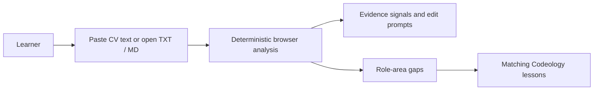

# CV Analysis migration and implementation plan

**Status:** Initial local-first slice implemented on the Codeology development line
**Source reviewed:** `saurabhporwal/CA` at `d1aecc127b2a16567b1fe78461f81a50f8b04202`
**Target:** Codeology static academy and its future stateful platform

## Decision

CV Analysis is a good fit when it closes the gap between a learner's existing experience and Codeology's curriculum. The feature should help a learner answer three questions:

1. What evidence does my CV already communicate?
2. Which role-relevant signals are weak or absent?
3. Which Codeology lessons should I study or use to build stronger evidence?

It should not present a speculative employability score, promise job readiness, infer protected characteristics, or treat a CV as independently verified evidence. Its output is formative guidance based only on the text supplied by the learner.

## Why the source implementation is not copied directly

The reviewed Career Architect implementation contains useful product concepts: target-role selection, document intake, role-gap analysis, recommendations, and a follow-on CV improvement flow. Its current technical shape does not fit Codeology's first release:

- It is a Next.js and FastAPI application backed by authentication, a database, object storage, and an external model provider.
- PDF and DOCX extraction depends on libraries outside this repository's educational dependency allowlist.
- The analysis path stores parsed CV text and results.
- Diagnostic output includes CV excerpts and part of the model credential, which is unsuitable for personal career data.
- No explicit licence file was found in the inspected source snapshot. This implementation therefore reuses product ideas and writes original Codeology code; it does not copy source code or visual assets.

Before any later code-level reuse, the owners should record the source project's licence and confirm that its contributors permit the intended migration.

## Initial product slice

The first slice is deliberately local-first:



- The browser accepts pasted text or a local plain-text/Markdown file.
- The CV is capped at 50,000 characters and is held only in page memory.
- No CV text, filename, analysis, or target role is uploaded, persisted, logged, or placed in `localStorage`.
- The deterministic engine detects common CV sections, quantified outcomes, ownership, delivery, reliability, collaboration, and role-specific technical terms.
- Results use `clear`, `some`, and `not found` evidence labels rather than a global candidate score.
- Curriculum recommendations resolve against the generated `PHASES` catalog and open the existing lesson reader.
- The interface identifies the result as private formative guidance, not an assessment or Codeology skill claim.

PDF and DOCX are intentionally deferred. Asking learners to paste extracted text avoids introducing document parsers into the static academy and makes the privacy boundary unambiguous.

## Target files and ownership

| Capability | Codeology location | Notes |
|---|---|---|
| Navigation tab | `site/codeology-config.json` | Adds a working `CV Analysis` route to the shared shell |
| Page structure | `site/cv-analysis.html` | Accessible form, privacy explanation, empty and result states |
| Analysis policy | `site/cv-analysis-engine.js` | Pure deterministic module, usable in the browser and Node tests |
| Browser interaction | `site/cv-analysis.js` | File reading, validation, rendering, clearing, focus management |
| Visual language | `site/codeology.css` | Reuses Codeology tokens, typography, focus, surface, and responsive patterns |
| Contract validation | `scripts/validate_codeology_cv_analysis.py` | Checks privacy, accessibility, routes, assets, and documentation |
| Behavior tests | `scripts/test_cv_analysis_engine.mjs` | Exercises role matching, signal detection, limits, and deterministic results |

All of these files are original Codeology work and must remain assigned to the `codeology` source in `content-sources.yml`.

## Analysis contract

Input:

```json
{
  "cvText": "Learner-supplied CV text",
  "targetRole": "ai-engineer",
  "jobDescription": "Optional learner-supplied role context"
}
```

Output:

```json
{
  "summary": "Plain-language evidence summary",
  "document": {
    "wordCount": 0,
    "sections": [],
    "quantifiedStatements": 0
  },
  "signals": [],
  "roleAreas": [],
  "editPrompts": [],
  "lessonQueries": []
}
```

The engine is intentionally explainable. Each result is derived from named terms or patterns. It does not infer years of experience, seniority, salary, personality, demographic attributes, identity, authorship, or suitability for employment.

## Later server-assisted phase

A deeper semantic review may be worthwhile after the local slice is tested with learners. That phase belongs behind Codeology's stateful platform boundary and requires a separate approval because it changes the privacy and cost model.

Required gates:

1. Obtain explicit consent before transmitting CV content and name the model provider, purpose, retention period, and deletion route.
2. Prefer ephemeral processing. Do not retain the raw CV by default, and never log document text, contact details, prompts, model responses, credentials, or signed URLs.
3. Strip contact fields before model review unless they are required for a learner-requested formatting check.
4. Treat the CV and job description as untrusted data, not instructions. Keep provider prompts and policies outside the document payload.
5. Enforce file type, byte, page, text-length, archive, and processing-time limits before parsing.
6. Use schema-validated model output with an `insufficient evidence` outcome. Keep deterministic lesson mapping separate from model prose.
7. Provide export and deletion controls before storing any result.
8. Keep this formative surface separate from demonstrated or verified Codeology evidence.
9. Add provider-failure, prompt-injection, malformed-document, accessibility, mobile, and deletion tests before release.

If PDF or DOCX support is required, implement parsing in the future platform service rather than adding non-allowlisted dependencies to lesson code or the static academy.

## Rollout and rollback

Roll out first on the `dev` test environment. Review at desktop and mobile widths in light and dark themes, test keyboard-only operation, and ask pilot learners whether the recommended lessons are relevant and whether the evidence labels are understandable.

The slice is reversible: remove the navigation entry and the three `site/cv-analysis*` files. It creates no schema, account, storage, or migration dependency.

## Acceptance criteria

- A learner can paste CV text or read a local `.txt`/`.md` file and analyze it without a network request.
- Short, empty, unsupported, and oversized inputs fail with an actionable message.
- Results identify their evidence basis and do not display a job-readiness or employability score.
- Every curriculum recommendation resolves to an existing local lesson route.
- Clearing the form removes the CV text and rendered analysis from memory-visible UI state.
- The page works by keyboard, exposes a single main landmark, uses live status messaging, and preserves visible focus.
- Targeted checks, `npm run check:precommit`, and `npm run ci` pass before handoff.
