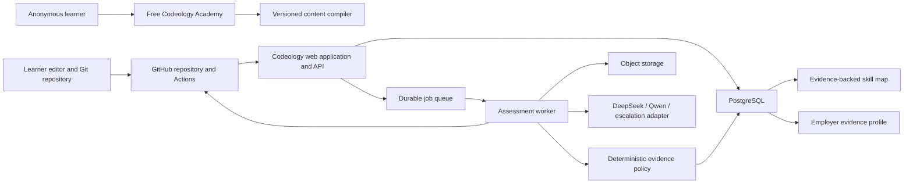
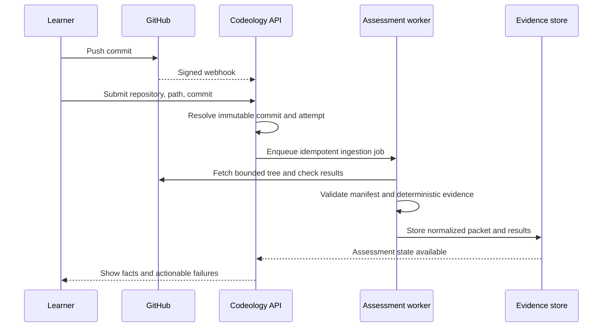

# Codeology Product and Implementation Plan

**Status:** Working product plan  
**Created:** 2026-08-12  
**Repository baseline:** Fork of `rohitg00/ai-engineering-from-scratch`  
**Audience:** Product, engineering, curriculum, assessment, design, and future partners

---

## 1. Executive decision

Codeology will preserve the strongest parts of AI Engineering from Scratch: its pixel-editorial visual language, lesson-reading experience, curriculum corpus, roadmap interaction, glossary, search, figures, quizzes, and content-quality tooling.

Codeology will not inherit its definition of progress or attempt to turn browser-local completion into an employment credential. The new product value will come from realistic engineering scenarios completed in learner-owned repositories, commit-bound assessment, evidence-backed skill progression, and employer-readable proof of work.

The implementation strategy is deliberately incremental:

1. Keep the existing academy working and visually intact.
2. Rebrand it carefully and add transparent source attribution.
3. Introduce structured Codeology pathways, skills, scenarios, rubrics, and provenance beside the existing curriculum.
4. Validate the local-editor and public-GitHub workflow with a small pilot.
5. Add a modular application layer for identity, repository ingestion, assessment, evidence, and profiles.
6. Use deterministic checks first and low-cost AI models for bounded qualitative review.
7. Reserve the word **verified** for assessment that Codeology controls independently.

The product contract is:

> Codeology provides excellent learning content, realistic work specifications, verification rules, and evidence packaging. Learners own their editor, AI tools, compute, and Git repositories.

---

## 2. What the agent debate concluded

Three independent positions were considered.

### 2.1 Maximum-reuse position

This position argued that the current static product is not a disposable prototype. It already contains a polished responsive UI, lesson renderer, catalog, glossary, command palette, themes, accessible interactions, read-aloud support, diagrams, quizzes, and hundreds of lessons. Rewriting it before validating Codeology's defining repository-to-evidence loop would delay learning and create visual regressions.

Its strongest point was:

> Preserve the working academy, add scenarios and repository assessment through narrow seams, and rewrite only when a demonstrated requirement breaks those seams.

### 2.2 Platform and security position

This position argued that the static site cannot safely become the trusted assessment platform. `localStorage`, generated global JavaScript, README parsing, custom Markdown rendering, and client-side state are appropriate for a public curriculum but not for identity, repository permissions, audit history, assessment orchestration, or credentials.

Its strongest point was:

> The moat should be the evidence graph, assessment policy, trustworthy receipts, and employer interpretation—not the static lesson renderer or an opaque AI score.

### 2.3 Learning, assessment, and employer position

This position argued that technically reproducible grading can still measure the wrong thing. Codeology must define what each claim means, calibrate every AI-assisted rubric against human judgments, distinguish practice from verification, account for unequal learner resources, and prove that employers can understand the evidence quickly.

Its strongest point was:

> The go/no-go question is not merely whether Codeology can grade a repository. It is whether the resulting evidence helps a learner understand their growth and helps an employer make a better, fairer judgment than a résumé or unstructured GitHub profile.

### 2.4 Final synthesis

The accepted strategy is a staged hybrid:

- Reuse the academy aggressively.
- Preserve upstream content paths wherever possible.
- Add structured sidecars rather than migrating 503 lessons immediately.
- Keep learning progress separate from skill evidence.
- Introduce a modular application and worker only when stateful product features require them.
- Treat learner repositories and their contents as hostile input.
- Treat learner-controlled GitHub Actions as useful practice evidence, not independent verification.
- Let AI produce bounded rubric judgments; let a deterministic policy engine derive skill state.
- Delay controlled code execution until demand justifies its cost and security burden.

---

## 3. Product principles

### 3.1 Free learning remains free

The imported AI Engineering pathway, ordinary lesson reading, glossary, search, quizzes, and Codeology's foundational learning materials should remain freely accessible without an account.

Potential paid value may later include high-trust verification, private-repository support, organisation dashboards, cohort management, employer tooling, and premium assessment capacity. Free content should not be weakened to manufacture demand for those services.

### 3.2 Open-tool assessment

Learners may use VS Code, Cursor, Codex, Claude Code, ChatGPT, Qwen Code, local models, documentation, search, or other ordinary engineering tools. Codeology assesses the resulting engineering work and the learner's ability to respond to follow-up requirements; it does not pretend to prove that work was produced without AI.

### 3.3 Evidence before badges

Every meaningful skill claim must link to inspectable evidence. A glowing node, result badge, or employer-facing statement must be explainable in terms of an immutable submission, checks, rubric criteria, and assurance level.

### 3.4 Honest assurance language

Codeology must never collapse these states:

| State | Meaning | Evidence allowed |
|---|---|---|
| Learned | The learner consumed or understood instructional material | Visits, reading activity, quizzes |
| Practised | The learner attempted work and ran public checks | Learner repository and learner-controlled checks |
| Demonstrated | An immutable artifact passed Codeology's bounded review | Commit SHA, deterministic observations, rubric evidence |
| Verified | Codeology independently checked the artifact and a freshly administered follow-up | Controlled checks, hidden conditions, follow-up delta, signed receipt |

A fresh follow-up demonstrates an ability to modify work under new conditions. It does not by itself prove identity, sole authorship, or unaided capability. Artifact assurance, identity assurance, and assessment supervision must be recorded as separate dimensions.

### 3.5 Local-first engineering

The product should not require Codeology to operate an IDE or pay for ordinary learner compute. Learners work in their preferred local or cloud environment and retain ownership of their repositories and portfolio artifacts.

### 3.6 Stable, versioned claims

Display names, URLs, models, and rubrics will change. IDs, published content versions, submitted commits, and issued receipts must remain stable and reproducible.

### 3.7 Upstream respect

Imported content must remain traceable to its author, licence, original path, and source commit. Codeology must clearly distinguish unmodified imported content, adapted content, and original Codeology work, without implying upstream endorsement.

---

## 4. Reuse and modification map

| Existing area | Plan | Reason |
|---|---|---|
| `site/style.css` | Preserve as the visual reference; gradually extract tokens/components | This is the design language Codeology wants |
| `site/index.html` and `site/app.js` | Rebrand and adapt incrementally | The curriculum presentation is already polished |
| `site/lesson.html` | Retain initially; add attribution and scenario panels | It already supports content, code, figures, quizzes, navigation, and TOC |
| `site/roadmap.js` and `site/roadmap.css` | Use as the visual prototype for the skill map | The interaction model is strong, though the data model must change |
| Catalog, glossary, command palette, themes, TTS | Retain | High-value functionality with little need for early reinvention |
| `phases/`, lesson code, quizzes, and outputs | Publish as a credited free pathway | Provides immediate depth and useful learning material |
| Existing content audits | Retain and extend | They provide a strong quality baseline |
| `site/build.js` and README parsing | Keep for the imported pathway during transition | Replacing a working build before validating new schemas adds risk |
| `site/progress.js` | Keep only for anonymous learning progress; replace for evidence | Browser-local state cannot support trusted claims |
| `site/data.js` | Treat as generated legacy output, not the new domain model | It is too large and tightly coupled to the static site |
| Custom Markdown rendering | Restrict to trusted curriculum content | Learner content is untrusted and must not be rendered directly |
| Books, translations, Claude certification | Keep dormant and out of primary navigation initially | Potential future value, but not an MVP priority |
| Sponsors, traffic claims, badges, original branding | Remove from the Codeology experience | They do not represent Codeology and can imply endorsement |
| Upstream workflows that self-commit | Replace or gate before platform work | Product CI should produce reviewed artifacts, not mutate protected branches |

---

## 5. Target learner and employer experience

### 5.1 Learner journey

1. Browse a free pathway and its dependency graph.
2. Read lessons, use interactive explanations, and complete formative quizzes.
3. Select a realistic scenario mapped to several skills.
4. Download or initialize a challenge pack in a learner-owned repository.
5. Work in any editor and use any permitted AI companion.
6. Run tests, linting, type checks, and manifest validation locally or through GitHub Actions.
7. Push the work and submit an exact repository, path, and commit SHA.
8. Receive deterministic feedback and a criterion-level AI-assisted review.
9. See demonstrated skills illuminate with links to supporting evidence.
10. Optionally complete controlled verification for a stronger assurance level.
11. Share selected evidence through an employer-readable profile.

### 5.2 Employer journey

An employer should be able to understand a candidate's strongest evidence in under a minute:

- What realistic situation did the learner handle?
- What constraints and trade-offs existed?
- Which immutable commit was assessed?
- Which objective checks passed?
- What engineering qualities were observed?
- What assurance level does Codeology claim?
- Can the employer inspect or reproduce the result?

The employer interface should show a small number of strong proof cards, not hundreds of completion badges or a single opaque candidate score.

---

## 6. Target repository shape

The existing `site/` should remain the production academy through the MVP and may remain so indefinitely. Do not move all upstream content or extract packages merely to satisfy an idealized monorepo diagram. Begin with a thin platform boundary after the manual pilot, and extract a shared package only when it has at least two real consumers or measured maintenance pain.

The following is an evolutionary destination rather than a Stage 0 migration requirement:

```text
apps/
  web/                         # Codeology application and public product routes
  worker/                      # Webhook, ingestion, assessment, and receipt jobs

packages/
  design-system/               # Extracted pixel-editorial components and tokens
  content-schema/              # Pathway, skill, lesson, scenario, rubric schemas
  content-compiler/            # Validation and immutable content releases
  assessment-core/             # Provider-neutral criteria, evidence, and policies
  github-integration/          # GitHub App, webhook, tree, checks, and artifact adapter
  model-gateway/               # Small DeepSeek/Qwen/escalation adapter

content/
  codeology/
    pathways/
    skills/
    scenarios/
    rubrics/

phases/                        # Imported AI Engineering lessons; preserve upstream paths
glossary/                      # Imported glossary source
site/                          # Existing static academy and visual reference during migration
scripts/                       # Existing audits plus Codeology validators
docs/                          # Architecture, product, security, and source documentation
```

The initial backend should be a modular monolith:

- One web application/API.
- One background worker process.
- One managed PostgreSQL database.
- One managed object store.
- One durable job queue.
- Provider adapters for GitHub and AI models.

Microservices are unnecessary until scale, team boundaries, or security isolation create a concrete reason.

The first stateful release may use a single `platform/` application rather than the full `apps/` and `packages/` layout. The directory split should follow proven boundaries, not precede them.

---

## 7. Target system architecture



The public academy and the trusted platform have different responsibilities:

| Public academy | Trusted platform |
|---|---|
| Free lessons and pathways | Identity and account state |
| Glossary, search, figures, and quizzes | GitHub App installation and permissions |
| Reading progress | Commit-bound submissions |
| Curriculum content | Assessment orchestration |
| Source attribution | Evidence and skill-state policy |
| Anonymous access | Employer profiles and signed receipts |

---

## 8. Core domain model

### 8.1 Content and curriculum

| Entity | Purpose |
|---|---|
| `ContentSource` | Author, project, licence, URL, source commit, and modification state |
| `Pathway` | A coherent learning or practice route |
| `Skill` | A stable, inspectable competency definition |
| `SkillEdge` | Prerequisite or related-skill relationship |
| `Lesson` / `LessonVersion` | Instructional content and immutable published versions |
| `Scenario` / `ScenarioVersion` | Realistic work specification and immutable revisions |
| `Rubric` / `RubricVersion` | Versioned assessment definition |
| `RubricCriterion` | Observable quality or hard-reject condition |

### 8.2 Identity and repository ingestion

| Entity | Purpose |
|---|---|
| `User` | Learner identity and settings |
| `OAuthIdentity` | GitHub login linkage |
| `RepositoryConnection` | GitHub numeric repository ID and installation access |
| `Attempt` | Server-issued scenario attempt |
| `Submission` | Exact repository, subdirectory, commit, tree, and manifest snapshot |
| `WebhookDelivery` | Idempotency and replay protection for GitHub events |
| `IngestionArtifact` | Bounded file list, check summaries, and normalized review packet |

### 8.3 Assessment and evidence

| Entity | Purpose |
|---|---|
| `AssessmentRun` | One versioned execution of an assessment policy |
| `CheckResult` | Deterministic result and provenance |
| `AIReview` | Model, prompt, rubric, output, cost, and latency metadata |
| `CriterionScore` | Anchored criterion judgment |
| `EvidenceItem` | Immutable path/blob/line observation supporting a criterion |
| `SkillEvidence` | Versioned projection from criteria into skills |
| `SkillStateVersion` | Reproducible aggregation of a learner's evidence |
| `AssessmentReceipt` | Public, signed summary bound to a commit and policy version |
| `Appeal` | Learner challenge, decision, and audit history |

### 8.4 Portfolio and governance

| Entity | Purpose |
|---|---|
| `PortfolioSettings` | Public/private visibility and selected proof cards |
| `ShareLink` | Expiring private employer access |
| `AuditEvent` | Append-only record of security and trust-sensitive operations |
| `ConsentRecord` | Repository and model-provider disclosure consent |

---

## 9. Staged implementation plan

## Stage 0 — Preserve the baseline and establish governance

### Outcome

Codeology can change confidently without losing the original product, violating source obligations, or making upstream synchronization ambiguous.

### Features and work

- Tag the untouched import baseline.
- Keep `origin` connected to the Codeology fork and `upstream` connected to the original repository.
- Create a protected Codeology development branch.
- Add `THIRD_PARTY_NOTICES.md` and a source attribution policy covering substantially reused lessons, CSS, JavaScript, figures, templates, fonts, images, and external scripts.
- Inventory assets separately from the repository licence, including multiple contributors or licences where applicable.
- Capture visual baselines for homepage, lesson, roadmap, catalog, and glossary.
- Document the upstream sync process.
- Preserve upstream audit/build commands where practical, but prevent upstream automation from committing directly to protected Codeology branches. Generated drift should fail with regeneration instructions.
- Write an initial repository-ingestion threat model.

### Implementation details

- Preserve upstream-owned paths during early work.
- Centralize brand, URLs, feature flags, and source configuration instead of replacing every internal `AIFS*` symbol.
- Make upstream's push URL unusable locally if practical; updates should arrive through fetch and reviewed changes.
- CI should run the existing curriculum audits and snapshot the static build.

### Exit gate

- The original site still builds and renders.
- Curriculum audits pass.
- Reused asset ownership and licence provenance are recorded, and third-party notices are a release gate.
- Upstream updates can enter only through review.
- The five visual baseline pages have stored reference screenshots.

### Not in this stage

- Product rebranding.
- Accounts.
- Repository submission.
- Any learner code execution.

---

## Stage 1 — Codeology academy shell and attribution

### Outcome

The existing experience visibly becomes Codeology while the imported AI Engineering content remains free, clearly credited, and fully functional.

### Learner-facing features

- Codeology name, favicon, metadata, navigation, and product proposition.
- “AI Engineering Foundations” as an imported free pathway.
- Source badges on pathway and lesson pages.
- Clear labels for original, imported, and adapted material.
- Initial navigation for pathways, skill map, scenarios, submissions, and profile.
- Existing catalog, glossary, figures, search, themes, TTS, accessibility, and quizzes retained.

### Implementation details

- Add a central Codeology site configuration file.
- Replace hardcoded public project URLs through configuration rather than broad search-and-replace.
- Add source metadata to the build output. Derive provenance centrally from pathway metadata, original path, and the pinned upstream baseline so imported lesson files can remain byte-for-byte unchanged.
- Add per-lesson source metadata only when Codeology modifies that lesson.
- Add build-time validation that imported/adapted content and substantially reused code or assets carry complete provenance.
- Keep the current static hosting path during this stage.
- Preserve existing CSS variables, layouts, animations, keyboard behavior, and reduced-motion support.
- Remove original sponsor claims, traffic claims, creator branding, and implied endorsements from the Codeology navigation and marketing surface.

Example source metadata:

```yaml
source:
  project: AI Engineering from Scratch
  author: Rohit Ghumare
  url: https://github.com/rohitg00/ai-engineering-from-scratch
  license: MIT
  originalPath: phases/14-agent-engineering/01-the-agent-loop
  sourceCommit: 7c3323508a5186739feecd76838ba1ae962c736f
  adapted: true
  adaptationSummary: Added Codeology scenario and evidence mapping
```

### Exit gate

- The site is recognizably Codeology.
- Every reused surface has resolvable provenance without requiring edits to every imported lesson.
- The imported pathway remains usable without an account.
- No existing reader, roadmap, search, glossary, theme, TTS, keyboard, or mobile behavior regresses.

---

## Stage 2 — Assessment charter, skill graph, and scenario contract

### Outcome

Codeology defines what it measures before building a grading system.

### Product scope

- One pilot pathway.
- Approximately 8–12 fine-grained skills.
- Six scenarios: two guided, two intermediate, and two portfolio-grade.
- Published definitions of learned, practised, demonstrated, and verified.
- Open-tool policy allowing ordinary AI assistance.
- Anchored rubric levels such as `insufficient`, `developing`, `competent`, and `strong` rather than false precision.

### Implementation details

- Add structured pathway, skill, scenario, and rubric schemas.
- Use stable IDs even when display names and URLs change.
- Version every published scenario and rubric immutably.
- Map each rubric criterion to observable evidence and a small number of skills.
- Separate hard rejects from quality criteria.
- Add challenge/source data beside existing content rather than rewriting all imported lessons.
- Extend the build to emit a separate validated Codeology data artifact.
- Add `scripts/audit_codeology_content.py` or equivalent schema validation.
- Conduct a target-role job-task analysis before naming the pathway's competencies.
- Maintain an assessment blueprint showing task, criterion, and skill coverage across the pilot.
- Review mappings with software engineers, hiring managers, and an assessment or learning-design specialist.
- Run cognitive interviews with pilot learners to confirm that tasks elicit the intended reasoning rather than accidental knowledge of wording or tooling.
- Map criteria explicitly to skill evidence; do not treat scenario-level weights as mastery percentages.

Example scenario manifest:

```yaml
schemaVersion: 1
scenarioId: backend/api-rate-limiter
scenarioVersion: 1
title: Harden a production rate limiter
pathwayId: backend-engineering

skills:
  - backend.api-design
  - backend.concurrency
  - backend.automated-testing

criterionMappings:
  - criterionId: concurrency-safety
    skillId: backend.concurrency
    evidenceRole: primary
  - criterionId: failure-tests
    skillId: backend.automated-testing
    evidenceRole: supporting

submission:
  mode: learner-owned
  publicRepositoryRequired: true
  allowedLanguages: [typescript, python]
  requiredFiles: [README.md]
  maxRepositoryBytes: 20000000

checks:
  - id: manifest
    kind: structure
  - id: public-tests
    kind: github-check
  - id: engineering-review
    kind: ai-rubric

rubric: rubrics/backend/api-rate-limiter-v1.yml
aiPolicy: open-tool
source:
  type: codeology
```

### Exit gate

- Subject-matter reviewers agree that scenarios represent real engineering work.
- A job-task analysis and assessment blueprint justify the claimed skill coverage.
- Cognitive interviews show that learners interpret the tasks and criteria as intended.
- Employers can understand the assurance labels.
- Invalid IDs, graph edges, versions, rubrics, and source metadata fail CI.
- At least three scenarios can be completed manually without a Codeology-specific IDE.

---

## Stage 3 — Learner-owned repository protocol and formative checks

### Outcome

The defining workflow works end to end without Codeology hosting an IDE or executing arbitrary learner code.

### Learner-facing features

- Downloadable challenge pack or GitHub template repository. Add an initialization CLI only after the pilot stabilizes the manifest and directory contract.
- Support for a single `codeology` monorepo for small scenarios.
- Support for separate repositories for portfolio-scale projects.
- IDE-neutral companion files containing context, constraints, and rubric guidance.
- Preflight tests, linting, type checks, and manifest validation.
- Manual submission of repository URL, subdirectory, and exact commit SHA.
- Clear practice/self-checked labels.

Recommended learner layout:

```text
codeology/
  .codeology/
    index.json
  challenges/
    backend/
      api-rate-limiter--01K2NC/
        codeology.yml
        README.md
        src/
        tests/
        evidence/
```

The readable slug helps humans; the generated attempt ID identifies the instance. During this manual protocol pilot, manifest values are untrusted discovery assertions and IDs may be provisional. Once the platform exists, the server-side `Attempt` record is authoritative and the manifest must match it. The directory hash or attempt ID is not a security secret and does not prove authorship.

### Implementation details

- Provide a pinned, reusable GitHub Actions workflow for public practice checks.
- Bind every submission to repository, subdirectory, commit SHA, tree SHA, scenario version, and rubric version.
- Discover `codeology.yml` manifests; use `.codeology/index.json` only as an optimization.
- Validate repository and file bounds before any model review.
- Ignore or reject binaries, archives, dependency trees, huge files, symlinks, submodules, Git LFS pointers, and unsafe paths according to explicit policy.
- Provide a local or pre-commit secret scan before the first public push. Server-side scanning is a secondary warning; an exposed secret must be revoked and rotated because deleting a file does not erase Git history or prior exposure.
- Publish minimum hardware, time, dependency, and free-tool requirements for every pilot scenario.
- Provide an equivalent accommodation path for learners who cannot safely publish a public repository.
- Never execute learner code inside the web server.
- Treat learner-controlled check output as formative evidence only.

### Exit gate

- A new learner can initialize, complete, push, and submit a pilot scenario without staff help.
- Pilot learners can complete the scenario using the published free-tool and minimum-hardware route.
- The submitted snapshot remains reproducible after the branch advances.
- Invalid and malicious repository structures fail safely.
- Most pilot learners can diagnose failed public checks from the feedback provided.

---

## Stage 4 — Platform foundation, identity, and GitHub integration

### Outcome

Codeology gains durable state without forcing a premature rewrite of the entire academy.

### Stage 4A — Minimal stateful submission

Features:

- GitHub OAuth sign-in for identity and API-rate-limit handling.
- Durable learner and submission records in managed PostgreSQL.
- Manual repository URL, subdirectory, and commit-SHA submission.
- On-demand or simple background assessment jobs.
- Submission status, retry, and actionable ingestion errors.
- User data export, deletion, and visibility controls.

Implementation details:

- Start with one `platform/` application if that is simpler than creating multiple apps and packages.
- Keep `site/` as the production academy; do not migrate anonymous reading progress during the MVP.
- Resolve repository and branch references to immutable commit SHAs at submission time.
- Persist only the assessment and evidence state required for the defining product loop.

### Stage 4B — Automated repository integration

Add this only when push-triggered reassessment, selected-repository permissions, or private-repository support creates real demand.

- Introduce a least-privilege GitHub App rather than long-lived personal access tokens.
- Store GitHub numeric repository IDs because names can change.
- Verify webhook HMAC signatures and deduplicate by delivery ID.
- Fetch repository trees at the submitted SHA rather than observing the moving default branch.
- Add a durable worker and queue with explicit leases, retry ceilings, dead-letter handling, and idempotent jobs.
- Add object storage with documented retention and deletion rules for evidence packets and artifacts.
- Provision environment separation, database migrations and backups, managed secrets/key infrastructure, and baseline logs, metrics, and traces.
- Add authenticated reading-progress synchronization only if research shows it materially improves retention. Keep educational progress separate from assessed competency.

Example progress event:

```text
ProgressEvent
- user_id
- lesson_version_id
- event_type: visited | quiz_attempted | practice_completed
- payload
- occurred_at
```

### Exit gate

- Anonymous reading remains available.
- Stage 4A can bind an authenticated user, server-side attempt, scenario/rubric version, repository, path, and immutable commit.
- Database backups and recovery have been tested.
- Before Stage 5 automation, job retry/dead-letter behavior and stored evidence retention are tested.
- If Stage 4B is enabled, renamed repositories resolve through numeric GitHub IDs, webhook replay is harmless, and revoking the GitHub App prevents future access.
- No client-generated action can create demonstrated or verified evidence.

---

## Stage 5 — Deterministic assessment pipeline

### Outcome

Objective facts are established before AI is asked for judgment.

### Features

- Manifest and scenario-version validation.
- Required-file and repository-structure checks.
- Ingestion of GitHub check conclusions and bounded artifacts.
- Normalized, inspectable evidence bundle.
- Assessment status timeline and specific failure messages.
- Versioned result records.

### Implementation details



- Use idempotency keys for submissions, jobs, and model calls.
- Store the exact manifest snapshot and content digest.
- Snapshot each check-run ID, producing workflow or GitHub App identity, head SHA, completion time, conclusion, normalized log summary, and artifact digest before artifacts expire or a check is rerun.
- Cap repository size, file count, per-file size, logs, and artifacts.
- Do not trust a green learner-owned workflow as independent verification.
- Label this assurance level as self-checked, public-repository observed, or practice-reviewed.

### Exit gate

- Reprocessing the stored immutable evidence packet produces the same deterministic result. Do not promise reproducibility from re-querying mutable GitHub check state.
- Duplicate webhook and job delivery cannot duplicate assessment state.
- Every result links to its provenance.
- Learner-controlled evidence is never displayed as independently verified.

---

## Stage 6 — Calibrated AI rubric review

### Outcome

Low-cost models add useful qualitative judgment without becoming an opaque authority.

### Model strategy

1. Deterministic checks establish objective facts.
2. A low-cost coding/reasoning model such as DeepSeek or Qwen evaluates versioned qualitative criteria.
3. Deterministic server-side validation checks that every cited blob, path, line range, and quotation exists in the immutable snapshot; a model or human may then judge semantic relevance.
4. Borderline, conflicting, high-risk, and randomly sampled results go to a second model.
5. Remaining disagreements and appeals go to a premium model or human reviewer.

### Implementation details

- Put providers behind a small internal adapter.
- Send only a bounded, relevant repository snapshot or diff.
- Require schema-valid criterion results.
- Require immutable file path, blob SHA, and line evidence for every positive or negative judgment.
- Store model identifier, provider, prompt version, rubric version, temperature, input digest, output, latency, and cost.
- Use `insufficient evidence` rather than inventing a score.
- Do not trust self-reported model confidence as calibration.
- Use disagreement, criterion risk, evidence coverage, and random audits for escalation.
- Give reviewer models no shell, network, GitHub write access, secrets, or autonomous tools.
- Treat README files, source comments, filenames, and repository instructions as hostile prompt-injection data.
- Never allow repository content to select tools, models, prompts, or policies.
- Keep AI companion conversations private and separate from grading.
- Remove repository owner, username, avatar, timestamps, and irrelevant identity signals from review packets. Grade prose quality only when it is explicitly job-relevant.
- Build an initial human-scored benchmark containing at least 100 representative artifacts for feasibility, but do not treat that number as sufficient for every language, framework, criterion, or subgroup.
- Obtain two independent, model-blinded subject-matter ratings plus adjudication, and keep separate tuning and held-out evaluation sets.
- Define criterion-specific false-accept, false-reject, stability, and agreement thresholds before evaluating the held-out set.
- Treat subgroup results from the small pilot as exploratory. Use consented optional demographic analysis, minimum cell sizes, controlled counterfactual tests, and larger stratified samples before making fairness claims.

Example model output:

```json
{
  "criterionId": "error-handling",
  "level": "competent",
  "decision": "pass",
  "evidence": [
    {
      "path": "src/limiter.ts",
      "blobSha": "f11a...",
      "startLine": 84,
      "endLine": 91,
      "observation": "Rejects invalid window values before mutating state"
    }
  ],
  "gaps": ["No test covers clock rollback"]
}
```

### Quality measures

- Criterion-level human/model agreement.
- False passes and false failures, especially on hard rejects.
- Test-retest stability for identical inputs.
- Disagreement by language, framework, and controlled identity-neutral variants; optional learner-group analysis only under the consent and minimum-cell protocol.
- Appeal and overturn rates.
- Cost and latency per completed assessment.
- Percentage of claims rejected for missing evidence.

### Exit gate

- Pre-agreed thresholds are met on the held-out, independently rated and adjudicated evaluation set.
- Hard-reject false passes remain within the published assurance tolerance.
- Identical artifacts receive acceptably stable outcomes.
- Meaningful subgroup disparities are mitigated or the affected assessment is not launched.
- Learners can inspect evidence and appeal.
- AI output cannot directly change a skill node.

---

## Stage 7 — Evidence-backed glowing skill graph

### Outcome

The visual skill map becomes an honest index of inspectable learner evidence rather than a completion animation.

### Features

- States for unexplored, learned, practised, demonstrated, verified, and stale.
- Glow intensity reflecting evidence strength and assurance level.
- Node drawer showing supporting scenarios, commits, checks, and rubric criteria.
- Recommended next scenarios based on evidence gaps.
- Accessible labels and patterns so colour/glow is never the only signal.
- Placement and prior knowledge influence recommendations but cannot award verification.

### Implementation details

- Use a directed acyclic skill graph rather than assuming every pathway is a tree.
- Feed the new graph through a compatibility adapter for the existing `roadmap.js` renderer first. Rewrite the renderer only if measured node scale, accessibility, or interaction requirements prove it insufficient.
- Project criterion results into `SkillEvidence` through curated, versioned rules.
- Require repeated evidence across more than one context for durable competency claims.
- Include assurance level, rubric coverage, evidence recency, repeated success, and context diversity in the aggregation policy.
- Store versioned `SkillState` snapshots; never rewrite historical evidence when the policy changes.
- Avoid a global competence percentage or leaderboard.

Suggested assurance levels:

| Level | Label | Meaning |
|---|---|---|
| 0 | Learner reported | Self-declared activity only |
| 1 | Repository observed | Public immutable artifact recorded |
| 2 | Commit-bound reviewed | Deterministic facts plus bounded AI rubric review |
| 3 | Independently executed | Codeology-controlled isolated checks |
| 4 | Controlled follow-up | Independently executed artifact plus a freshly administered change or defect |

This table describes **artifact assurance only**. Record identity assurance (`unverified`, `account-linked`, or `identity-checked`) and administration mode (`self-directed`, `controlled`, or `supervised`) separately. A fresh follow-up does not prove sole authorship or unaided capability, and payment for a higher-assurance assessment must not be presented as higher underlying ability.

### Exit gate

- Every illuminated node opens the evidence that caused it to illuminate.
- Recomputing state from the evidence ledger produces the same result.
- Invalidating evidence updates skill state predictably without deleting history.
- Learners understand why nodes have their current states.
- Subject-matter experts agree the aggregation policy does not overclaim mastery.

---

## Stage 8 — Employer evidence profiles

### Outcome

Learners can present a small set of strong, independently inspectable engineering proofs.

The MVP claim is limited to evidence clarity and work-sample inspection. Increased employer confidence is not proof that Codeology predicts job performance. Do not claim job readiness, predictive validity, or hiring utility without later criterion-related or longitudinal validation.

### Features

- Explicitly opt-in public profiles.
- Three to five highlighted proof cards.
- Scenario brief, constraints, tools-allowed policy, and learner-written context.
- Assessed repository and exact commit.
- Deterministic checks and criterion-level findings.
- Assurance label and assessment date.
- Reproduction instructions and receipt page.
- Expiring private share links.
- Immediate unpublish controls.

### Implementation details

- Bind receipts to repository ID, commit SHA, tree SHA, scenario version, rubric version, assessment policy, evidence digest, and issue date.
- Sign high-trust receipts using a managed key service, not an ordinary application environment variable.
- Separate learner-authored claims from Codeology findings visually and semantically.
- Do not expose raw model chain-of-thought or private AI conversations.
- Do not rank candidates with one opaque score.
- Rate-limit and monitor scraping.
- Make accessibility and mobile presentation release requirements.
- Compare employer interpretations with blinded expert ratings and measure misunderstanding of assurance limits, not just employer confidence.
- If controlled verification carries a fee, provide waivers or sponsored capacity and prevent the UI from treating payment-derived assurance as higher underlying ability.

### Exit gate

- Employer pilot users can identify a learner's strongest skills and inspect evidence in under 60 seconds.
- Employers correctly interpret each assurance level.
- Evidence pages improve clarity and inspection compared with a bare GitHub link; no predictive-employment claim is made.
- Employer interpretations align with blinded expert ratings and published assurance limits.
- Removing public visibility works immediately.
- No unsupported claim is displayed as verified.

---

## Stage 9 — Controlled verification

### Outcome

Codeology can issue a high-trust verification result for selected final assessments without operating compute for ordinary learning.

### Features

- Codeology-controlled checkout of the exact submitted commit.
- Hidden tests or conditions.
- Disposable isolated execution.
- Small randomized, independently administered follow-up change or injected defect. This demonstrates an ability to modify the work but does not by itself prove identity, sole authorship, or unaided capability.
- Human escalation for consequential failures and appeals.
- Signed verified receipt.

### Implementation details

- Buy established sandbox infrastructure before considering a custom executor.
- Use disposable microVMs or equivalent isolation, not plain multi-tenant Docker as an MVP shortcut.
- Disable egress by default.
- Provide no ambient cloud credentials.
- Enforce CPU, memory, disk, process, output, and wall-clock limits.
- Use read-only pinned base images, lockfile enforcement, allowlisted dependency caches or a controlled package proxy, and disposable writable layers. Learner code should not require general network access.
- Inject hidden tests through a one-way mount or equivalent secure channel only after isolation begins; verify every image, dependency, and artifact digest.
- Automatically destroy execution state after result capture.
- Keep a full audit trail and emergency kill switch.
- Test equivalent follow-up variants for comparable difficulty.

### Exit gate

- Independent security review or penetration testing is complete.
- Escape and resource-exhaustion tests pass.
- Hidden tests and secrets are not observable by learner code.
- Verification cost per learner is known and sustainable.
- Equivalent free or sponsored verification capacity exists for learners unable to pay.
- Signed execution attestation is bound to the exact submitted commit.
- Incident response and runner shutdown procedures have been rehearsed.

---

## Stage 10 — Organisations, private repositories, and ecosystem scale

### Outcome

Only after evidence quality and learner demand are proven, Codeology expands into institutional workflows.

### Candidate features

- Private repository support with explicit provider-retention policy.
- University and bootcamp cohorts.
- Employer-authored scenarios with moderation and validity review.
- Team scenarios and collaboration evidence.
- Organisation dashboards and cohort analytics.
- Additional open-source curriculum partners.
- Verified credentials and selective hiring discovery.

### Constraints

- Do not launch an empty employer marketplace.
- Do not introduce opaque automated hiring recommendations.
- Do not send private repository content to a model provider without explicit disclosure, appropriate contractual terms, retention controls, and deletion workflows.
- Do not let partner branding weaken source provenance or assessment consistency.

### Exit gate

- Earlier stages demonstrate repeat learner usage and employer value.
- Legal, privacy, fairness, moderation, and security reviews cover the new use case.
- Organisation features have design partners rather than speculative requirements.

---

## 10. Assessment policy details

### 10.1 Hard rejects versus quality criteria

Hard rejects should cover observable conditions that invalidate a submission, such as:

- The submitted commit cannot be resolved.
- Required files are absent.
- Public checks do not correspond to the submitted commit.
- The manifest identifies a different scenario or attempt.
- The repository exceeds published limits.
- A learner-run public check reports that the declared entrypoint failed. Before Stage 9 this is a reported practice failure, not an independently established runtime fact.
- A prohibited artifact is present for that scenario.

Quality criteria should use anchored descriptions with examples and counterexamples. They should not be disguised style preferences.

### 10.2 Correctness and judgment

Deterministic checks should own claims such as the following, with the published assurance level identifying whether the check was learner-controlled or Codeology-controlled:

- Tests pass.
- Types compile.
- Required API behavior is present.
- Output format matches the contract.
- Known security property is violated.

Before controlled execution exists, Codeology can independently establish manifest, repository, commit, tree, and stored-check provenance. It must distinguish those facts from the behavior reported by learner-controlled workflows. Authoritative runtime claims begin only when Codeology controls the execution environment.

AI-assisted review may judge:

- Clarity of decomposition.
- Appropriateness of trade-offs.
- Test quality beyond raw pass count.
- Error handling and maintainability.
- Architecture decisions and documentation.

### 10.3 Evidence aggregation

A single criterion result should not automatically become a durable skill claim. The aggregation policy should consider:

- How directly the criterion measures the skill.
- The assurance level of the assessment.
- Whether evidence exists in multiple contexts.
- Whether success was repeated.
- How recently fast-changing skills were demonstrated.
- Whether any later result contradicts earlier evidence.

### 10.4 Appeals

Learners must be able to:

- See the rubric version and evidence used.
- Correct a factual evidence-linking error.
- Submit a new commit as a new assessment.
- Appeal an assessment that affects a published claim.
- Receive a recorded outcome without silent history rewriting.

---

## 11. Security and privacy requirements

Public repositories are public, but they are not safe or free of privacy concerns. Code, Markdown, filenames, history, generated logs, and test artifacts are all untrusted.

### 11.1 Repository ingestion

- Allow only approved GitHub hosts to prevent SSRF.
- Use numeric repository IDs and immutable commit SHAs.
- Apply file count, path depth, total byte, individual file, and artifact limits.
- Reject traversal paths and unsafe Unicode normalization cases.
- Explicitly handle symlinks, submodules, Git LFS, binaries, and archives.
- Never execute repository code during ingestion.
- Quarantine suspicious content and make failure safe and explainable.

### 11.2 GitHub integration

- Use a least-privilege GitHub App.
- Encrypt installation tokens and sensitive integration metadata through managed key infrastructure.
- Verify webhook HMAC signatures.
- Deduplicate delivery IDs.
- Record security-sensitive actions in append-only audit events.
- Pin third-party Actions by full commit SHA.

### 11.3 Model review

- Treat repository instructions as data, never authority.
- Give models no credentials or uncontrolled tools.
- Keep system prompts, rubrics, and policies outside the repository payload.
- Bound and delimit all repository content.
- Validate every response against a schema.
- Verify cited evidence independently.
- Escape evidence before display.
- Publish provider, retention, and deletion disclosures.

### 11.4 Application security

- Use secure, HTTP-only cookies and CSRF protection.
- Establish a strict Content Security Policy.
- Remove inline event handlers as the UI is componentized.
- Sanitize rendered Markdown and never reuse the trusted curriculum renderer for arbitrary learner HTML.
- Add secret, dependency, SAST, and licence scanning to Codeology CI.
- Protect `main`; CI should not self-commit generated files.

### 11.5 Learner privacy

- Warn against publishing employer code, secrets, personal data, or material the learner does not own.
- Provide local/pre-commit secret scanning before the first public push where possible, and explain that exposed credentials require revocation and rotation.
- Make employer profiles private by default.
- Support data export, account deletion, evidence unpublishing, and integration revocation.
- Define which assessment and security records are deleted, pseudonymized, or retained for fraud, legal, or receipt-integrity purposes. Minimize personal data in public receipt payloads.
- Provide receipt status/revocation endpoints and signing-key rotation. Unpublishing a profile removes public presentation but does not silently pretend an issued cryptographic receipt never existed.
- Keep AI companion conversations outside assessment unless the learner explicitly opts in.

---

## 12. Testing and release strategy

### 12.1 Academy and design tests

- Visual regression tests for homepage, pathway, lesson, skill map, catalog, and glossary.
- Mobile and desktop viewport coverage.
- Keyboard navigation and focus-order tests.
- Reduced-motion and contrast checks.
- Trusted content compilation and broken-link tests.

### 12.2 Platform tests

- Unit tests for domain policies and schema validators.
- Integration tests against recorded GitHub webhook and API fixtures.
- Idempotency and replay tests.
- Repository-boundary fuzz tests.
- End-to-end submission tests pinned to immutable fixture repositories.
- Data export, deletion, and permission-revocation tests.

### 12.3 Assessment tests

- Golden human-scored artifact set.
- Criterion-level agreement and variance reports.
- Prompt-injection test repositories.
- Evidence citation verification tests.
- Provider failover and malformed-output tests.
- Cost and latency budgets.
- Appeals and version-migration tests.

### 12.4 Controlled runner tests

- Sandbox escape attempts.
- Fork bombs and process exhaustion.
- Disk, memory, CPU, log, and timeout exhaustion.
- Network egress denial.
- Hidden-test and credential leakage tests.
- Automatic teardown and kill-switch drills.

---

## 13. Observability and cost controls

Track the complete assessment lifecycle through structured events:

- Submission received.
- Commit resolved.
- Tree bounded and normalized.
- Public checks ingested.
- Deterministic policy completed.
- Model request started/completed/failed.
- Evidence validation completed.
- Assessment published or escalated.
- Skill state recomputed.
- Receipt issued or revoked.

Cost controls should include:

- Per-user and per-scenario budgets.
- Bounded file retrieval and diff-first review.
- Context caching where supported.
- Retry ceilings and idempotency.
- Model escalation only on defined conditions.
- Random audit sampling rather than universal premium review.
- Cost-per-completed-assessment dashboards.

Important service metrics:

- Time to first valid submission.
- Assessment completion latency.
- Repository ingestion failure rate.
- Model schema failure and retry rate.
- Human/model agreement.
- False-pass, false-fail, and appeal overturn rates.
- Assessment cost by scenario and language.
- Employer proof-card open and evidence-click rates.

---

## 14. Upstream synchronization strategy

### 14.1 Remote roles

```text
origin   -> akshatporwal002/ai-engineering-from-scratch
upstream -> rohitg00/ai-engineering-from-scratch
```

### 14.2 Ownership boundaries

During early stages:

- `phases/`, imported glossary material, and selected `site/` behavior remain close to upstream.
- New Codeology schemas, scenarios, platform applications, assessment packages, and evidence policies are Codeology-owned.
- Brand and attribution changes should be centralized to reduce recurring conflicts.

### 14.3 Update process

1. Fetch `upstream/main`.
2. Review the upstream changelog and diff by subsystem.
3. Import security, accessibility, lesson, figure, and content-quality improvements selectively.
4. Run upstream curriculum audits.
5. Run Codeology content-schema and attribution audits.
6. Run visual regression tests.
7. Merge through a reviewed pull request.

Do not assume every upstream change should merge. The fork will increasingly diverge in navigation, product data, workflows, and state management.

### 14.4 Source registry and automatic content labelling

Imported and original content should remain physically and logically separate:

```text
phases/                                      # Upstream AI Engineering lessons
glossary/                                    # Upstream glossary
content/
  codeology/
    pathways/                                # Original Codeology pathways
    lessons/                                 # Original Codeology lessons
    scenarios/                               # Repository-based scenarios
    rubrics/                                 # Versioned assessment rubrics
  overrides/
    ai-engineering-from-scratch/             # Sidecars for adapted imported content
content-sources.yml                          # Central source and path registry
```

The source registry assigns provenance by the most specific matching path rule:

```yaml
schemaVersion: 1
sources:
  ai-engineering-from-scratch:
    paths:
      - phases/**
      - glossary/**
    project: AI Engineering from Scratch
    author: Rohit Ghumare and contributors
    url: https://github.com/rohitg00/ai-engineering-from-scratch
    remote: upstream
    license: MIT
    imported: true

  codeology:
    paths:
      - content/codeology/**
    project: Codeology
    author: Codeology contributors
    original: true
```

Build behavior:

- Anything under an upstream path is automatically labelled as imported.
- Anything under `content/codeology/**` is automatically labelled as original Codeology content.
- The generated provenance record includes the full upstream commit SHA that supplied the file.
- Imported lesson files remain unchanged wherever possible.
- A sidecar under `content/overrides/` marks a lesson as adapted, records the adaptation, and links Codeology scenarios or skill mappings without editing the upstream lesson.
- The source registry supports multiple authors and licences rather than assuming every future source is MIT.
- A stable imported content ID uses source plus canonical path; explicit aliases preserve identity if upstream later renames a path.

Example adaptation sidecar:

```yaml
schemaVersion: 1
sourceId: ai-engineering-from-scratch
contentId: ai-engineering-from-scratch:phases/14-agent-engineering/01-the-agent-loop
adapted: true
adaptationSummary: Added a Codeology reliability scenario and evidence mapping
scenarioIds:
  - agents/recovering-tool-failures
skillIds:
  - agent-engineering.tool-reliability
```

### 14.5 Automated upstream intake

A scheduled or manually dispatched workflow should:

1. Fetch `upstream/main` and compare it with the last reviewed upstream commit.
2. Detect added, modified, renamed, and removed lessons or assets.
3. Apply source labels through `content-sources.yml` without modifying imported files.
4. Generate a human-readable provenance and change report.
5. Run upstream lesson audits, Codeology schema/provenance audits, licence checks, link checks, and visual smoke tests.
6. Block if a licence is missing or changed, attribution is incomplete, validation fails, or an upstream structural change breaks the adapter.
7. Open a pull request against the Codeology fork with the upstream range and generated report.
8. Require human review before merge and deployment.

Discovery and labelling should be automatic; merging and publishing should not be. This preserves the benefit of upstream additions without treating the upstream repository as an unreviewed production dependency.

### 14.6 Source automation exit gate

- A newly added upstream lesson receives complete imported-content metadata without a manual file edit.
- An original Codeology lesson receives Codeology metadata without mentioning the upstream project.
- An adapted imported lesson resolves both its original source and Codeology sidecar.
- Licence or source-registry failures block publishing.
- The workflow opens a reviewable pull request and never auto-merges upstream content.
- Removing or renaming upstream content produces an explicit migration report rather than silently breaking links.

---

## 15. Repository skill suite

### 15.1 Skill design rules

Repository skills should be small, independently triggerable operating procedures rather than one broad Codeology prompt. Each skill should:

- Use a lowercase verb-led name.
- Put precise triggering language in its `description` frontmatter.
- Keep `SKILL.md` concise and move schemas or policies into one-level `references/` files.
- Bundle deterministic scripts when consistency or security matters.
- Include only resources directly needed for the workflow.
- Produce inspectable artifacts and stop on failed validation.
- Avoid giving learner-facing tutor skills access to grader internals, hidden tests, or answer keys.
- Be validated with the skill validator and forward-tested on realistic tasks before being treated as reliable.

### 15.2 Must-have maintainer and platform skills

| Priority | Skill | Trigger and responsibility | Recommended resources |
|---|---|---|---|
| P0 | `codeology-sync-upstream` | Use when checking or importing changes from the original repository. Fetch, diff, auto-label, validate, and prepare a review report; never auto-merge. | `scripts/detect_upstream_changes.*`, source-registry reference, sync checklist |
| P0 | `codeology-author-scenario` | Use when creating or revising a repository-based engineering scenario. Produce the brief, manifest, rubric, criterion-to-skill mapping, starter pack, public checks, provenance, and exit validation. | Scenario templates, rubric anchors, job-task blueprint reference |
| P0 | `codeology-audit-content` | Use before publishing pathways, lessons, scenarios, rubrics, or imported content. Validate schemas, IDs, graph edges, source labels, licences, links, and generated indexes. | Deterministic audit scripts and schema references |
| P0 | `codeology-implement-ui` | Use when adding or changing Codeology pages and components. Preserve the pixel-editorial system, reuse existing interactions, meet accessibility rules, and run visual regression checks. | Design tokens, component inventory, screenshot-test script |
| P0 | `codeology-preflight-submission` | Use before a learner's first push or formal submission. Validate the manifest and attempt, run declared checks, scan for secrets, exclude unsafe files, and produce a submission-readiness report. | Preflight script, manifest schema, secret-response guidance |
| P0 | `codeology-assess-submission` | Use when assessing an immutable submission packet. Establish deterministic facts, run bounded rubric review, validate citations, apply escalation rules, and emit evidence without directly awarding skills. | Assessment schema, prompt templates, evidence validator, trust-label policy |
| P0 | `codeology-calibrate-assessment` | Use when adding a model, rubric, language, framework, or assessment version. Compare model-blinded SME ratings, held-out results, stability, false accepts/rejects, bias probes, cost, and release thresholds. | Evaluation scripts, metrics definitions, calibration report template |
| P1 | `codeology-review-trust-boundary` | Use when changing GitHub permissions, webhooks, repository ingestion, model access, receipts, or sandbox execution. Produce a focused threat review and required security tests. | Threat-model checklist, abuse cases, security gate reference |

The first implementation sequence should be:

1. `codeology-sync-upstream`
2. `codeology-author-scenario`
3. `codeology-audit-content`
4. `codeology-implement-ui`
5. `codeology-preflight-submission`
6. `codeology-assess-submission`
7. `codeology-calibrate-assessment`

The assessment skill may be prototyped earlier, but it must not publish strong claims until the calibration skill's release gate passes.

### 15.3 Learner-facing companion skills

| Priority | Skill | Learner outcome |
|---|---|---|
| P1 | `codeology-start` | Select a pathway, explain the open-tool policy, check prerequisites, initialize the repository layout, and create a local learning plan. Adapt useful parts of the existing `start-learning` skill rather than starting from nothing. |
| P1 | `codeology-work-scenario` | Help the learner interpret a brief, plan work, inspect the inherited codebase, run checks, and reflect on trade-offs without exposing hidden grader material or simply supplying a finished solution. |
| P1 | `codeology-explain-feedback` | Translate criterion-level evidence into an improvement plan, distinguish factual failures from qualitative feedback, and prepare a new commit rather than rewriting the historical result. |
| P2 | `codeology-course-guide` | Route a question or evidence gap to the most relevant free lesson, scenario, glossary term, or prerequisite. Adapt the existing `course-guide` skill and include source labels in recommendations. |

AI companion and grading skills must remain separate. The companion may know the public brief, constraints, public rubric, and tests; it must never load private grader prompts, hidden tests, calibration answers, or escalation thresholds.

### 15.4 Skill folder pattern

```text
skills/
  codeology-sync-upstream/
    SKILL.md
    agents/openai.yaml
    scripts/
      detect_upstream_changes.py
    references/
      source-registry.md
      sync-policy.md
```

Not every skill needs every folder. Add a script only for repeated deterministic work, a reference only for material that should be loaded conditionally, and an asset only when the skill copies or transforms it into an output.

### 15.5 Skill quality gate

- The skill triggers on realistic requests and stays inactive on unrelated tasks.
- Its instructions are concise, imperative, and contain no duplicated reference material.
- Bundled scripts have executable tests or representative validation runs.
- The skill produces the expected artifact from a clean checkout.
- Failure states stop safely and explain remediation.
- Learner-facing skills cannot access assessor-only resources.
- At least one forward test succeeds without giving the testing agent the intended answer.

---

## 16. Recommended pilot

### 16.1 Scope

- One pathway.
- 8–12 skills.
- Six scenarios across guided, intermediate, and portfolio difficulty.
- 30–50 learners.
- At least 100 artifacts as an initial feasibility set, each independently scored by two model-blinded subject-matter experts with adjudication and separated into tuning and held-out evaluation data.
- Larger stratified evaluation samples before making language-, framework-, or subgroup-fairness claims.
- At least five employer or recruiter reviewers.

### 16.2 Candidate scenario mix

1. Diagnose and fix a failing API test suite.
2. Add a rate limiter under concurrency constraints.
3. Plan and execute a backward-compatible database migration.
4. Review and harden an authentication boundary.
5. Improve observability and diagnose a production-style incident.
6. Extend a small inherited service with a change request and follow-up defect.

Each scenario should exercise overlapping skills so durable evidence can come from multiple contexts.

### 16.3 Pilot measures

- Time from first visit to valid repository submission.
- Scenario completion and abandonment points.
- Public-check failure recovery rate.
- Human/model agreement by criterion.
- False-pass, false-fail, rerun variance, and appeal overturn rates.
- Learner understanding of skill-map states.
- Employer ability to identify relevant evidence within 60 seconds.
- Whether evidence improves employer clarity and work-sample inspection relative to a bare GitHub profile.
- Agreement between employer interpretations, blinded expert ratings, and the published assurance limits.

### 16.4 Go/no-go questions

- Do learners complete realistic work without a hosted IDE?
- Is the repository protocol understandable and reliable?
- Does AI-assisted review add actionable value beyond deterministic checks?
- Can every skill claim be explained through evidence?
- Do employers interpret the assurance levels correctly?
- Do employers avoid inferring job readiness, identity, or sole authorship beyond the evidence presented?
- Is the assessment cost sustainable?

---

## 17. Deferred features

The following should not distract from the initial product loop:

- Hosted browser IDEs.
- Codeology-funded AI tutoring for every learner.
- Private repository support.
- Custom multi-tenant sandbox infrastructure.
- Employer candidate rankings.
- Hiring marketplace matching.
- University administration suites.
- Live pair programming.
- Plagiarism claims based solely on Git history.
- Full migration of all imported lessons into a new schema.
- Removal of books, translations, or certification content before their future value is assessed.

---

## 18. Immediate execution order

The next concrete repository changes should be:

1. Tag and document the upstream import baseline.
2. Add `content-sources.yml`, third-party notices, source sidecars, and provenance validation.
3. Implement and validate `codeology-sync-upstream` and the review-only upstream intake workflow.
4. Implement `codeology-audit-content` before publishing any rebranded or imported build.
5. Capture visual baselines and implement `codeology-implement-ui`.
6. Centralize Codeology brand and source configuration.
7. Rebrand the public shell without changing core interactions.
8. Define the four assurance labels and assessment charter.
9. Define the first pathway, skill graph, scenario schema, and rubric schema.
10. Implement `codeology-author-scenario` and build three manual pilot scenarios before implementing accounts.
11. Add schema audits and a generated Codeology data sidecar.
12. Implement `codeology-preflight-submission` and validate the learner-owned repository protocol manually.
13. Introduce the minimal platform application, GitHub OAuth, database, and manual commit-bound submission.
14. Add the GitHub App, durable worker/queue, and artifact storage only when automation requires them.
15. Add deterministic assessment and implement `codeology-assess-submission` before enabling AI grading.
16. Implement `codeology-calibrate-assessment`, then calibrate the low-cost model cascade.
17. Connect evidence to the glowing skill map through the existing roadmap renderer first.
18. Pilot employer proof cards before building controlled execution.

---

## 19. Definition of the MVP

The MVP is complete when:

- The Codeology-branded academy is public and the imported pathway is correctly attributed.
- A newly imported upstream lesson is automatically source-labelled and enters through a reviewed pull request.
- A learner can select one of the pilot scenarios.
- The learner can work in any editor and push to a public GitHub repository.
- Codeology can bind a submission to an immutable commit and scenario version.
- Deterministic checks and a calibrated AI-assisted rubric review produce criterion-level evidence.
- The result is honestly labelled as practice or commit-bound review, not verified.
- Demonstrated skill nodes link directly to the supporting artifact and assessment.
- A learner can share an opt-in employer proof page.
- The platform has measured learner usability, assessment agreement, cost, and employer comprehension.

High-trust isolated execution is not required for the MVP. It is the next assurance stage once the core evidence loop has proven demand.

---

## 20. Final product thesis

AI Engineering from Scratch gives Codeology an unusually strong academy, visual identity, content corpus, and authoring foundation. Codeology should preserve that advantage rather than spending its earliest effort recreating it.

The differentiation is not a larger lesson library or another AI tutor. It is the transition from learning to authentic work and from authentic work to evidence:

```text
Learn freely
  -> practise in your own environment
  -> submit an immutable artifact
  -> establish deterministic facts
  -> receive bounded qualitative review
  -> accumulate inspectable skill evidence
  -> present trustworthy proof to employers
```

If Codeology executes that loop honestly and well, the existing curriculum becomes more valuable, learner AI usage becomes compatible with assessment, infrastructure costs remain controlled, and the glowing skill map becomes a meaningful representation of demonstrated growth rather than decorative gamification.
